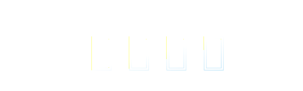
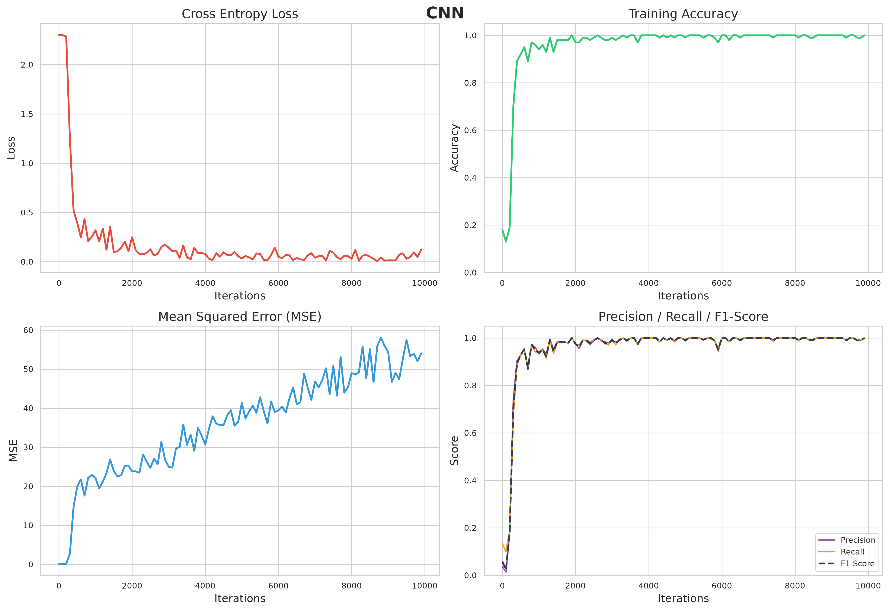
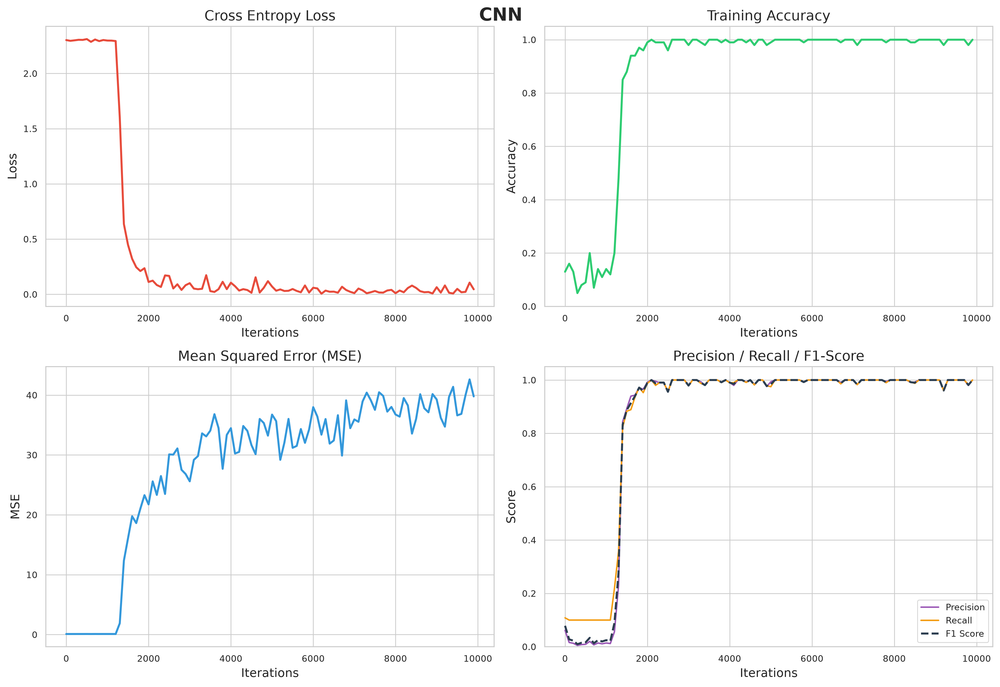
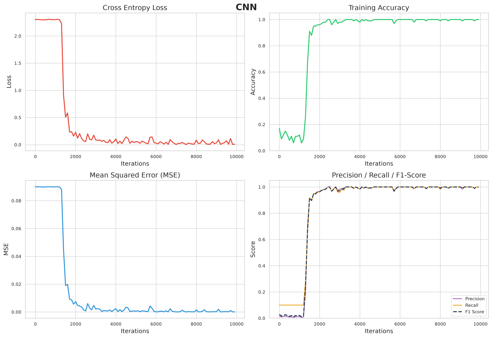
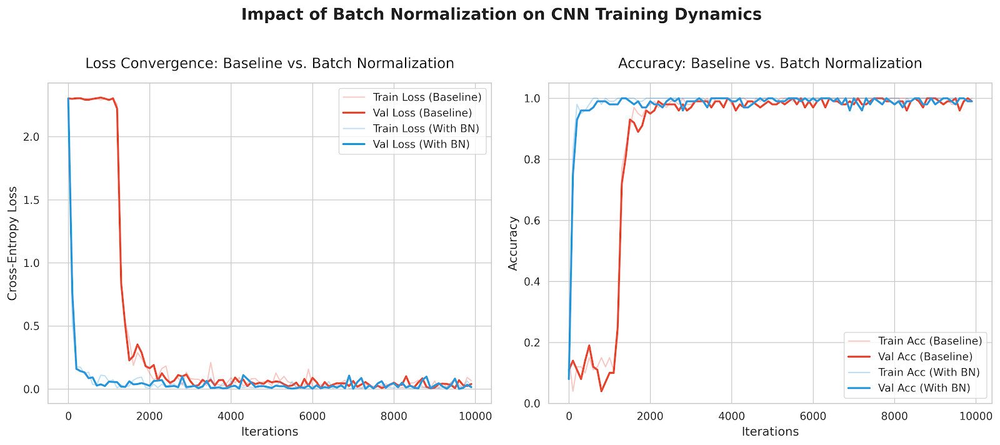
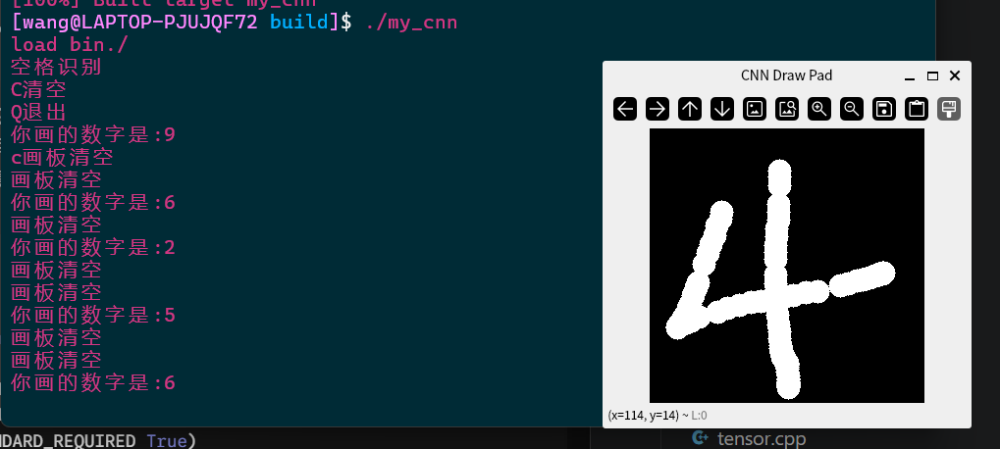
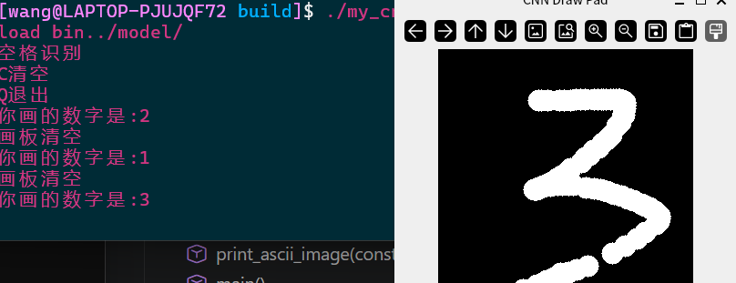
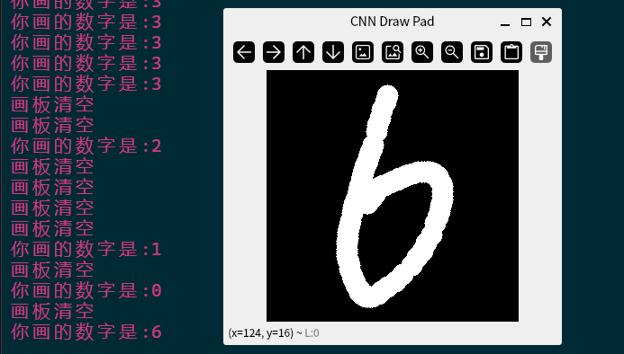

<div align="center">
  
</div>

## 写在开头
    此仓库为基于c++实现的基于miniset数据集的CNN神经网络手写识别
## 实现功能
    ** 张量计算（Tensor engine）：支持多维数据的内存管理形状重塑，并实现了im2col和col2im卷积空间展开算法
    ** CUDA加速：集成CUDA与cuBLAS将密集矩阵计算下放置GPU执行 ps有提升但感觉提升不大
    ** 网络架构：现已实现卷积层（Convolution），最大池化层（Pooling）,全连接层（Affine），激活函数（Relu），交叉熵损失层（SoftwithLoss）
    ** 双层CNN与L2正则化： 训练时发现存在严重过拟合问题，增加了双层特征提取架构(Conv->Pool->Conv->Pool->Affine->Affine),并在SGD优化器中加入L2正则化
    ** 评估体系：MSE ACC F1-score Pre Recall，训练时会保存权重到log里面详见metrics.cpp
    ** 手写识别：这部分比较简单不过多缀述，详见gui.cpp使用时打开main注释
## 项目架构
```text
C_CNN_Project/
├── include/                # 头文件目录：定义数据结构与接口
│   ├── Cnn_utils.hpp       # 底层空间拉平算法 (im2col, col2im) 声明
│   ├── gui.hpp             # 前端类声明
│   ├── layer.hpp           # 各类神经网络层 (Conv, Pool, ReLU, Affine) 定义
│   ├── load.hpp            # 数据集解析与预处理接口
│   ├── log.hpp             # CSV日志记录声明
│   ├── main.hpp            # 引用其他文件
│   ├── metrics.hpp         # 多维度评估指标 (Acc, MSE, F1 等)
│   ├── Model.hpp           # CNN 核心模型组装与权重管理
│   ├── optimizer.hpp       # 优化器接口 (SGD with L2 Regularization)
│   ├── predict.hpp         # 推理声明
│   ├── tensor.hpp          # 多维张量 (Tensor) 数据结构定义
│   └── Train.hpp           # 训练调度器声明
│
└── src/                    # 源文件目录：核心逻辑实现
    ├── Cnn_utils.cpp       # 卷积底层数学运算实现
    ├── gui.cpp             # OpenCV 窗口绘图与事件回调处理
    ├── layer.cpp           # 前向推理与反向链式求导实现
    ├── load.cpp            # MNIST 字节流解析、归一化、One-hot 编码
    ├── log.cpp             # 文件流安全读写与 CSV 自动落盘
    ├── main.cpp            # 程序主入口
    ├── metrics.cpp         # 混淆矩阵及各项指标公式计算
    ├── Model.cpp           # 双层网络搭建及参数更新
    ├── Oldmain.cpp         # 旧版测试入口代码
    ├── optimizer.cpp       # 梯度下降与 Weight Decay 惩罚项计算
    ├── predict.cpp         # 模型加载与单张图像前向预测逻辑
    ├── tensor.cpp          # CPU下的张量基础运算实现
    ├── tensor_cuda.cu      # GPU异构张量运算 (CUDA/cuBLAS)
    └── Train.cpp           # Batch划分、训练循环、验证与日志输出
```

## 训练结果大观：
第一版，过拟合严重但是此时还没注意到MSE这么大

第二版，过拟合好多了，注意到MSE不对了，修改MSE计算逻辑

ps:原来是predict输出的是最后一个全连接层的原始得分，没有经过softmax层归一化，修改
第三版：好多了。。。。


新增BN层的对比结果：
BN层的增加详见代码部分吧，计算与定义完全按照鱼书进行的。这次添加还算顺利没有什么太奇怪的报错


### 运行方式
其实本没有什么依赖要装，但是由于后期引入了前端和GPU异构运算，因此还是得装一下opencv和cuda
## 环境依赖
* **C++ 17**
* **Cmake >=3.18**
* **CUDA Toolkit**就够了
* **Opencv** arch这里还得多装一个QT6，在包管理模式下opencv和qt6是强绑定

## 编译
这里保留了makefile，不喜欢cmake可以使用makefile编译
```bash
mkdir build && cd build
cmake ..
make -j8
```

### 错误自查：
| 报错码 | 错误描述 (Trouble) |
| :---: | :--- |
| **1** | 文件打开失败 |
| **2** | SGD更新参数与计算梯度不一致 |
| **3** | reshape新形状的元素总数与原张量不一致 |
| **4** | 张量不是 4D |
| **5** | 保存模型失败 |
| **6** | 加载模型失败 |
###  trouble
## load加载问题
加载失败，各个参数明显错误；


大小端问题 详见load.cpp开头定义


## tensor
维度不匹配问题，代码中有个地方写成了1维度
找半天没找到，最后还是AI发现的

## cuda 维度错误
在cublasSgemm函数中，只要有一个指针地址是空的，或者传入的m, n, k维度计算不对，就会直接发生非法内存访问


## 预测结果：


### debug记录
layer Relu和affine测试：


softmaxwithloss:


两层MLP实现结果：


维度转换：


conv 训练结果：


# 结果：
这次效果其实不好因为我只做测试只取了前10000张并且只跑了1000轮，其实取出来的部分都没有跑完：



结果2：
现有的模型精度还是差了点，训练日志看old_tring可以看到MSE异常，模型过拟合严重。优化方案:optimizer中加入L2正则化，增加一层CNN网络（现为单层CNN）



结果3：




# debug存档：

    //测试load.cpp逻辑
    // for(int i =0;i<3; i++){
    //     print_image_ascii(train_dataset.images[i], train_dataset.labels[i]);
    // }

    //测试tensor.cpp逻辑
    // Tensor X({2, 3});//2*3矩阵
    // X.data = {1.0f, 2.0f, 3.0f, 4.0f, 5.0f, 6.0f};
    
    // Tensor W = Tensor::randn({3, 2}, 0.0f, 1.0f);//3*2
    // Tensor B({2}, 0.5f);
    
    // Tensor Y = X.dot(W) + B;
    
    // cout << "Tensor Y result:" << endl;
    // //应该是2*2
    // Y.print_shape();

    //     // 假装 (BatchSize=2, Features=2)
    //     Tensor X({2, 2});
    //     X.data = { 1.0f, -0.5f, 
    //               -2.0f,  3.0f};

    //     // 权重和偏置 (输入节点2，输出节点3)
    //     Tensor W({2, 3});
    //     W.data = {0.1f, 0.2f, 0.3f, 
    //               0.4f, 0.5f, 0.6f};
    //     Tensor b({3});
    //     b.data = {0.1f, 0.2f, 0.3f};

    //     //实例化层
    //     Affine affine_layer(W, b);
    //     Relu relu_layer;

    //     //
    //     cout << "正向\n";
    //     Tensor a1 = affine_layer.forward(X);
    //     Tensor y = relu_layer.forward(a1);
        
    //     print_tensor_data("输出 Y ", y);

    //    //假设梯度
    //     cout << "反向传播\n";
    //     Tensor dout({2, 3});
    //     dout.data = {1.0f, 1.0f, 1.0f,   // 样本1的梯度
    //                  1.0f, 1.0f, 1.0f};  // 样本2的梯度

    //     //先经过 ReLU，再经Affine
    //     Tensor da1 = relu_layer.backward(dout);
    //     Tensor dX = affine_layer.backward(da1);

    //     // 
    //     cout << "--- 梯度计算结果 ---\n";
    //     print_tensor_data("偏置梯度 db (应该反映出ReLU的阻断):", affine_layer.db);
    //     print_tensor_data("权重梯度 dW:", affine_layer.dW);
    //     print_tensor_data("传递给上一层的输入梯度 dX:", dX);
    
    // // 假设这是一个 3 分类问题
    // // 假设最后一层 Affine 输出了 2 个样本的得分 X
    // Tensor X({2, 3});
    // X.data = {
    //     10.0f,  1.0f, -1.0f,  // 样本1：模型极度自信这是第0类 (10.0分极高)
    //     -2.0f,  5.0f,  0.5f   // 样本2：模型自信这是第1类 (5.0分最高)
    // };

    // // 给出真实标签 T (One-hot 编码)
    // Tensor T({2, 3});
    // T.data = {
    //     1.0f, 0.0f, 0.0f,  // 样本1真实标签：第0类 (模型猜对了！)
    //     0.0f, 0.0f, 1.0f   // 样本2真实标签：第2类 (模型猜错了，其实是第2类！)
    // };

    // // 实例化层
    // SoftmaxWithLoss loss_layer;

    // cout << "正向传播：计算得分与概率\n";
    // float loss = loss_layer.forward(X, T);
    
    // print_tensor_data("原始得分 X:", X);
    // print_tensor_data("Softmax 转化后的概率 Y:", loss_layer.y);
    // cout << "当前 Batch 的平均误差 Loss = " << loss << "\n\n";

    // cout << "反向传播：惩罚梯度\n";
    // Tensor dX = loss_layer.backward();
    
    // print_tensor_data("回传梯度dx:", dX);


# 打印debug
    // void print_tensor_data(const string& name, const Tensor& t) {
    //     cout << name << " "; t.print_shape();
    //     for(int i=0; i<t.shape[0]; i++) {
    //         for(int j=0; j<(t.shape.size() > 1 ? t.shape[1] : 1); j++) {
    //             cout << t.data[i * (t.shape.size() > 1 ? t.shape[1] : 1) + j] << " ";
    //         }
    //         cout << endl;
    //     }
    //     cout << endl;
    // }
    // void print_tensor_data(const string& name, const Tensor& t) {
    //     cout << name << endl;
    //     for(int i=0; i<t.shape[0]; i++) {
    //         for(int j=0; j<(t.shape.size() > 1 ? t.shape[1] : 1); j++) {
    //             cout << fixed << setprecision(4) << t.data[i * (t.shape.size() > 1 ? t.shape[1] : 1) + j] << "  ";
    //         }
    //         cout << endl;
    //     }
    //     cout << endl;
    // }

    // void print_tensor_data(const string& name, const Tensor& t);


# conv测试
    // 模拟4D图像：Batch=1, 通道=1, 高=3, 宽=3
    Tensor img({1, 1, 3, 3});
    //1到9代表像素
    img.data = {1, 2, 3, 
                4, 5, 6, 
                7, 8, 9};

    cout << "原图像素 (3x3): \n";
    for(int i=0; i<3; i++) {
        for(int j=0; j<3; j++) { cout << img.data[i*3+j] << " "; }
        cout << "\n";
    }

    // 设定卷积核尺寸为 2x2，步幅为 1，无填充
    int filter_h = 2, filter_w = 2, stride = 1, pad = 0;
    
    cout << "\n正在使用 2x2 滤波器滑动展开...\n";
    Tensor col = im2col(img, filter_h, filter_w, stride, pad);

    cout << "\n展开后的大矩阵 col ";
    col.print_shape();
    
    // 打印出来的矩阵，应该每一行都对应滑动窗口取出的4个像素
    for(int i = 0; i < col.shape[0]; i++) {
        cout << "第 " << i << " 个局部区块: ";
        for(int j = 0; j < col.shape[1]; j++) {
            cout << col.data[i * col.shape[1] + j] << " ";
        }
        cout << "\n";
    }