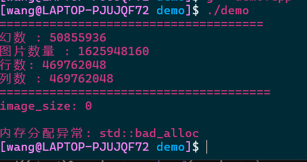
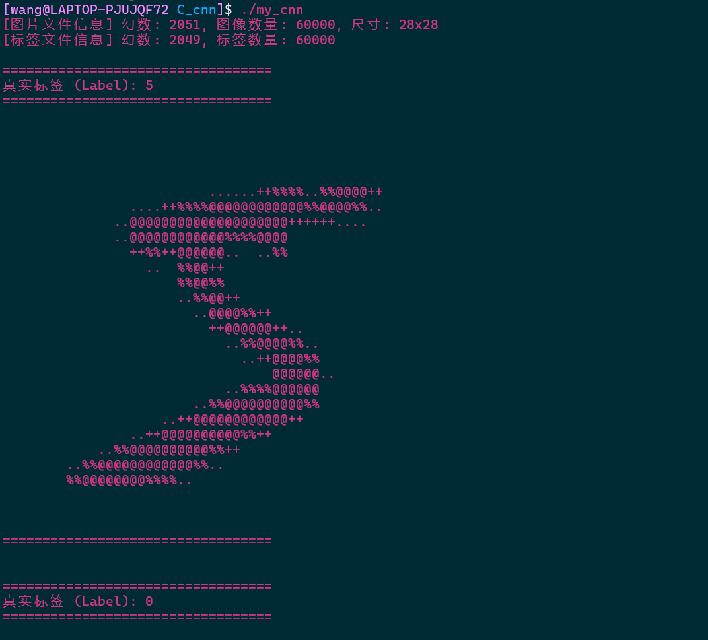
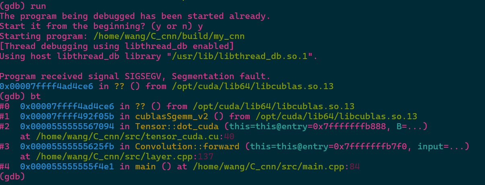
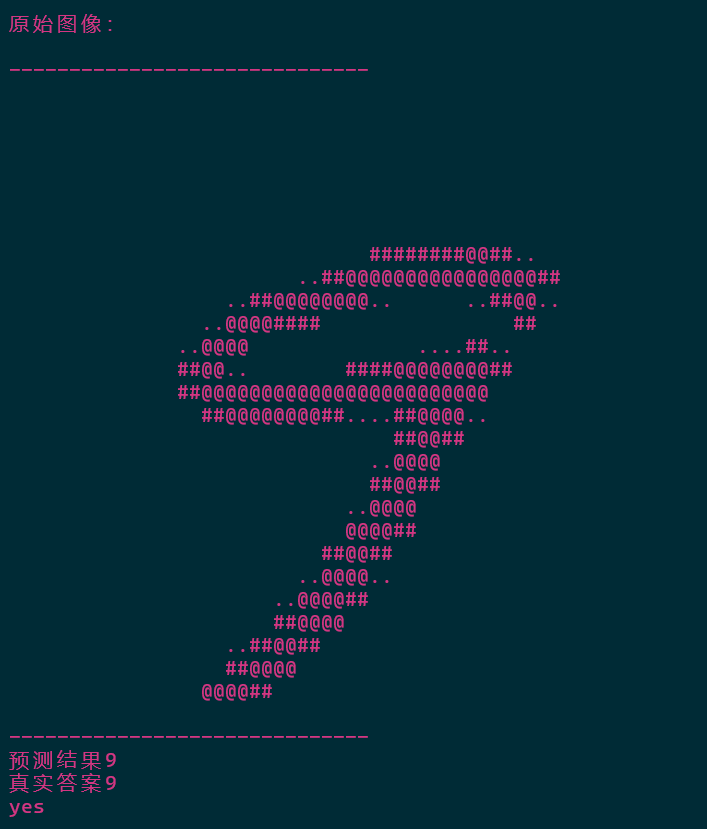
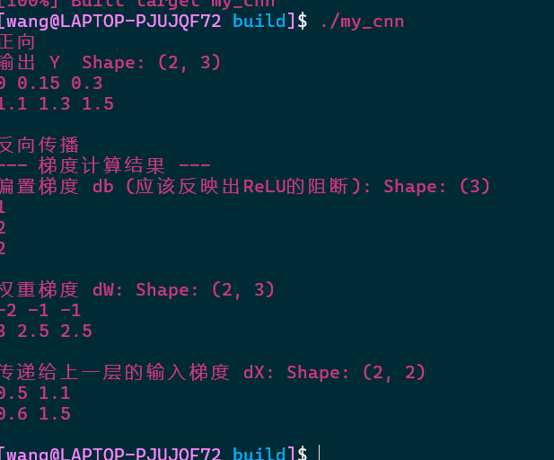
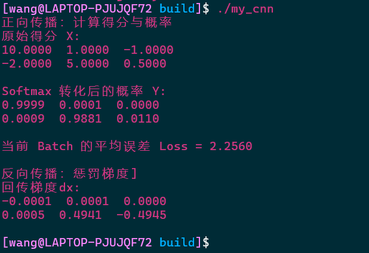
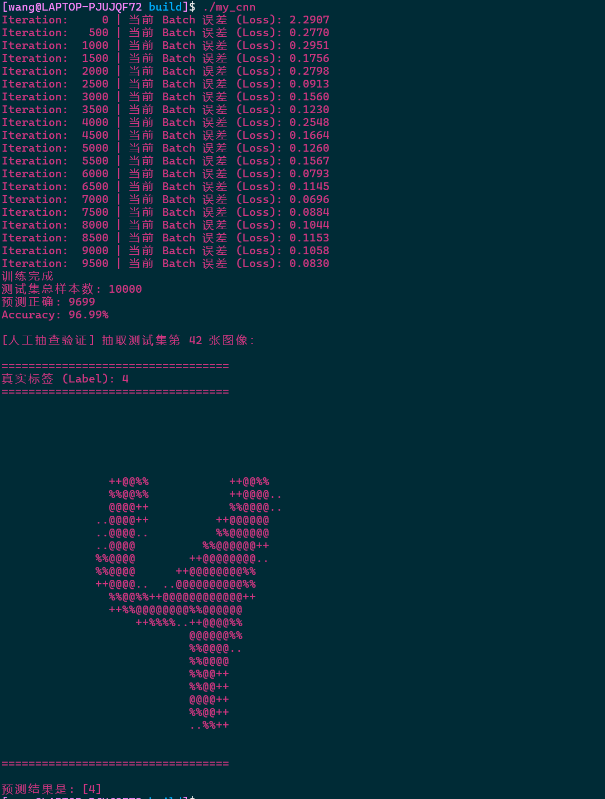
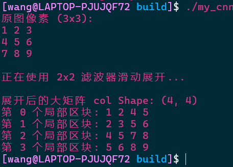
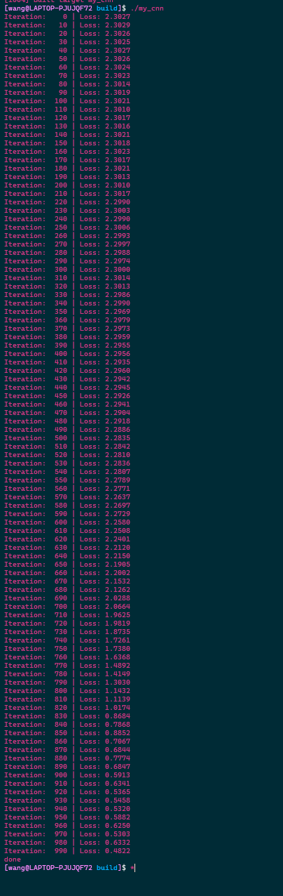

### 错误自查：
报错码      trouble
1           文件打开失败
2           SGD更新参数与计算梯度不一致
3           reshape新形状的元素总数与原张量不一致
4           张量不是4D
5           保存模型失败
6           加载模型失败
###  trouble
## load加载问题
加载失败，各个参数明显错误；

大小端问题 详见load.cpp开头定义

## tensor
维度不匹配问题，代码中有个地方写成了1维度
找半天没找到，最后还是AI发现的

## cuda 维度错误
在cublasSgemm函数中，只要有一个指针地址是空的，或者传入的m, n, k维度计算不对，就会直接发生非法内存访问

## 预测结果：

### debug记录
layer Relu和affine测试：

softmaxwithloss:

两层MLP实现结果：

维度转换：

conv 训练结果：

加入池化层：

# debug存档：

    //测试load.cpp逻辑
    // for(int i =0;i<3; i++){
    //     print_image_ascii(train_dataset.images[i], train_dataset.labels[i]);
    // }

    //测试tensor.cpp逻辑
    // Tensor X({2, 3});//2*3矩阵
    // X.data = {1.0f, 2.0f, 3.0f, 4.0f, 5.0f, 6.0f};
    
    // Tensor W = Tensor::randn({3, 2}, 0.0f, 1.0f);//3*2
    // Tensor B({2}, 0.5f);
    
    // Tensor Y = X.dot(W) + B;
    
    // cout << "Tensor Y result:" << endl;
    // //应该是2*2
    // Y.print_shape();

//     // 假装 (BatchSize=2, Features=2)
//     Tensor X({2, 2});
//     X.data = { 1.0f, -0.5f, 
//               -2.0f,  3.0f};

//     // 权重和偏置 (输入节点2，输出节点3)
//     Tensor W({2, 3});
//     W.data = {0.1f, 0.2f, 0.3f, 
//               0.4f, 0.5f, 0.6f};
//     Tensor b({3});
//     b.data = {0.1f, 0.2f, 0.3f};

//     //实例化层
//     Affine affine_layer(W, b);
//     Relu relu_layer;

//     //
//     cout << "正向\n";
//     Tensor a1 = affine_layer.forward(X);
//     Tensor y = relu_layer.forward(a1);
    
//     print_tensor_data("输出 Y ", y);

//    //假设梯度
//     cout << "反向传播\n";
//     Tensor dout({2, 3});
//     dout.data = {1.0f, 1.0f, 1.0f,   // 样本1的梯度
//                  1.0f, 1.0f, 1.0f};  // 样本2的梯度

//     //先经过 ReLU，再经Affine
//     Tensor da1 = relu_layer.backward(dout);
//     Tensor dX = affine_layer.backward(da1);

//     // 
//     cout << "--- 梯度计算结果 ---\n";
//     print_tensor_data("偏置梯度 db (应该反映出ReLU的阻断):", affine_layer.db);
//     print_tensor_data("权重梯度 dW:", affine_layer.dW);
//     print_tensor_data("传递给上一层的输入梯度 dX:", dX);
    
    // // 假设这是一个 3 分类问题
    // // 假设最后一层 Affine 输出了 2 个样本的得分 X
    // Tensor X({2, 3});
    // X.data = {
    //     10.0f,  1.0f, -1.0f,  // 样本1：模型极度自信这是第0类 (10.0分极高)
    //     -2.0f,  5.0f,  0.5f   // 样本2：模型自信这是第1类 (5.0分最高)
    // };

    // // 给出真实标签 T (One-hot 编码)
    // Tensor T({2, 3});
    // T.data = {
    //     1.0f, 0.0f, 0.0f,  // 样本1真实标签：第0类 (模型猜对了！)
    //     0.0f, 0.0f, 1.0f   // 样本2真实标签：第2类 (模型猜错了，其实是第2类！)
    // };

    // // 实例化层
    // SoftmaxWithLoss loss_layer;

    // cout << "正向传播：计算得分与概率\n";
    // float loss = loss_layer.forward(X, T);
    
    // print_tensor_data("原始得分 X:", X);
    // print_tensor_data("Softmax 转化后的概率 Y:", loss_layer.y);
    // cout << "当前 Batch 的平均误差 Loss = " << loss << "\n\n";

    // cout << "反向传播：惩罚梯度\n";
    // Tensor dX = loss_layer.backward();
    
    // print_tensor_data("回传梯度dx:", dX);

# 打印debug
// void print_tensor_data(const string& name, const Tensor& t) {
//     cout << name << " "; t.print_shape();
//     for(int i=0; i<t.shape[0]; i++) {
//         for(int j=0; j<(t.shape.size() > 1 ? t.shape[1] : 1); j++) {
//             cout << t.data[i * (t.shape.size() > 1 ? t.shape[1] : 1) + j] << " ";
//         }
//         cout << endl;
//     }
//     cout << endl;
// }
// void print_tensor_data(const string& name, const Tensor& t) {
//     cout << name << endl;
//     for(int i=0; i<t.shape[0]; i++) {
//         for(int j=0; j<(t.shape.size() > 1 ? t.shape[1] : 1); j++) {
//             cout << fixed << setprecision(4) << t.data[i * (t.shape.size() > 1 ? t.shape[1] : 1) + j] << "  ";
//         }
//         cout << endl;
//     }
//     cout << endl;
// }

// void print_tensor_data(const string& name, const Tensor& t);

# conv测试
    // 模拟4D图像：Batch=1, 通道=1, 高=3, 宽=3
    Tensor img({1, 1, 3, 3});
    //1到9代表像素
    img.data = {1, 2, 3, 
                4, 5, 6, 
                7, 8, 9};

    cout << "原图像素 (3x3): \n";
    for(int i=0; i<3; i++) {
        for(int j=0; j<3; j++) { cout << img.data[i*3+j] << " "; }
        cout << "\n";
    }

    // 设定卷积核尺寸为 2x2，步幅为 1，无填充
    int filter_h = 2, filter_w = 2, stride = 1, pad = 0;
    
    cout << "\n正在使用 2x2 滤波器滑动展开...\n";
    Tensor col = im2col(img, filter_h, filter_w, stride, pad);

    cout << "\n展开后的大矩阵 col ";
    col.print_shape();
    
    // 打印出来的矩阵，应该每一行都对应滑动窗口取出的4个像素
    for(int i = 0; i < col.shape[0]; i++) {
        cout << "第 " << i << " 个局部区块: ";
        for(int j = 0; j < col.shape[1]; j++) {
            cout << col.data[i * col.shape[1] + j] << " ";
        }
        cout << "\n";
    }